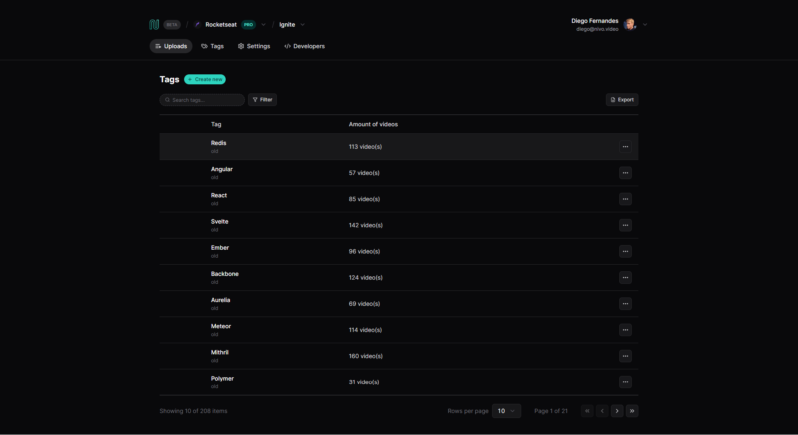

<h1 align="center"> React Data Listing </h1>

<p align="center">
  <a>
    
  </a>  
  <a>
    
  </a>
  <a>
    
  </a>
  <a href="https://lbesson.mit-license.org/" target="_blank">
    
  </a>
</p>

## 💻 Sobre o projeto

Projeto que mostra como fazer uma boa listagem de dados em ReactJS e também como fazer formulário usando React Hook Form + zod.

<br>

## 🎨 Layout

### Web

<p align="center">
  
</p>

<br>

## 🚀 Como executar este projeto

### Pré-requisitos

Para executar esta aplicação, você deverá ter instalado em sua máquina as seguintes ferramentas:

- [Git](https://git-scm.com/)
- [Node.js](https://nodejs.org/en/) - _v20.11.0_
- [NPM](https://www.npmjs.com/get-npm) ou [PNPM](https://pnpm.io/pt/) - _PNPM version: 8.14.2_

<br>

### 🎲 Rodando a aplicação web

```bash
# Clone este repositório -> usando SSH
$ git clone git@github.com:joaovitorJS/react-data-listing.git

# Acesse a pasta do projeto no seu terminal
$ cd react-data-listing

## Passos com pnpm

# Instale as dependências
$ pnpm i

# Execute o Json server em um terminal
$ pnpm run server

# O server irá abrir na porta 3333 - http://localhost:3333/

# Execute a aplicação web em modo de desenvolvimento
$ pnpm run dev

# O servidor web inciará na porta:5173 -
# acesse http://localhost:5173 em seu navegador para ver a aplicação funcionando
```

<br>

## 🛠 Tecnologias

- **[TypeScript](https://www.typescriptlang.org/)**
- **[ReactJS](https://pt-br.reactjs.org/)**

> Veja o arquivo [package.json](https://github.com/joaovitorJS/ignews/blob/main/package.json) para ver todas as dependências do projeto

<br>

## 👨🏻‍💻 Autor

<br>
<p>
  
</p>

## **[João Vitor](https://github.com/joaovitorJS)**

#### Entre em contato

<br>

<p>
  <a href="https://www.instagram.com/jaovitooor/">
  
  </a>
  &nbsp;
  <a href="https://www.linkedin.com/in/jo%C3%A3o-vitor-oliveira-85a886174/" target="_blank">
  
  </a>
  &nbsp;
  <a href="mailto:rgm38342@comp.uems.br">
  
  </a>
</p>

## 📝 Licença

Este projeto esta sobe a licença [MIT](https://opensource.org/licenses/MIT).
